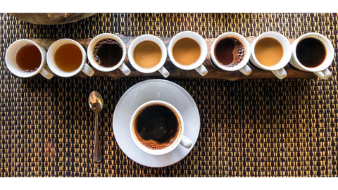

# Coffee Reivew Analysis 

  

This project aimed to analyze coffee reviews from a structured dataset and predict the overall coffee rating based on sensory attributes (aroma, acidity, body, flavor, aftertaste) and categorical features (origin, processing method, roasting level). 
The goal was to identify key factors influencing coffee quality and provide predictive insights for coffee producers and consumers.

 

## 📌 Project Objectives

1. Predict overall coffee ratings using machine learning models.
2. Identify the most influential features affecting coffee quality.
3. Analyze how origin, sensory attributes, and roast levels influence ratings.
4. Provide actionable insights for coffee producers.

## 🔬 Methodology

- **Data Wrangling**:  
    - **Data Collection**: Scraped data from [Coffee Review](https://www.coffeereview.com/), and enriched it with geographical and weather data using `geopy`. Additionally, weather information was obtained from the [OpenWeatherMap API](https://openweathermap.org/api).  
    - **Data Organization**: Merged several data sources.  
    - **Data Definition**: Classified coffee origins into specific geographical regions.  
    - **Data Cleaning**: Converted the price column to a consistent unit (USD).  

- **Exploratory Data Analysis (EDA)**:  
    Conducted data analysis using visualizations and inferential statistics, including ANOVA and t-tests.  

- **Preprocessing**:  
    Performed one-hot encoding for categorical features, applied normalization, and split the dataset into training and testing sets.  

- **Modeling**:  
  - **Baseline Models**: Linear Regression, Ridge Regression, Decision Tree  
  - **Advanced Models**: XGBoost, Multi-Layer Perceptron (MLP)  
  - Applied hyperparameter tuning using `GridSearchCV`  

## 🔍 Key Insights

- Sensory features such as aroma, acidity, and aftertaste are highly correlated with high ratings.
- Coffee beans from Hawaii and regions in Central America and Asia Pacific generally score higher.
- Medium roast coffee tends to receive the highest average ratings.

## 🚀 Future Work

- Add **sentiment analysis** on customer review text using NLP.
- Analyze **price vs rating** relationships.
- Explore **image-based models** (e.g., CNNs) for coffee bean visual quality assessment.

## 👨‍💻 Author
Wen-shan Liu

## 📸 Image credits
Pictire source: https://mostracoffee.com/blogs/the-mostra-minute/what-is-coffee-review